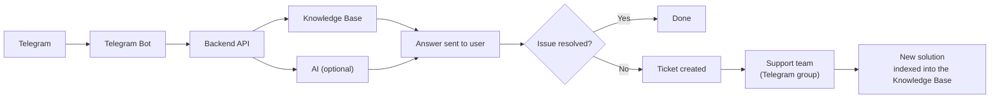

<picture>
  <source media="(prefers-color-scheme: dark)" srcset="frontend/public/stack-logo-white.png">
  <source media="(prefers-color-scheme: light)" srcset="frontend/public/stack-logo-full.png">
  
</picture>

<h1> Stack Wallet Telegram Support Bot</h1>

[](LICENSE)


A Telegram support bot with a knowledge base and an AI feedback loop: it answers questions, escalates to your team the moment it's stuck, and learns from every resolution — so the next person asking the same thing gets an instant answer instead of another ticket.

------

## How it works



A user asks a question, the bot searches the knowledge base (optionally backed by an LLM), and shows a YES/NO button to confirm it actually helped. A "no" opens a ticket in your private support group — an agent just replies to that message, the user gets the answer, and it's indexed back into the knowledge base for next time.

## Highlights

- **Instant Telegram support** — ask a question, get an answer pulled straight from a knowledge base that keeps learning from every ticket a human resolves.
- **One-tap escalation** — if the bot's answer doesn't help, a single "No" opens a ticket in your private support group; agents resolve it by just replying.
- **Optional AI** — works out of the box with free keyword and fuzzy text search (no embeddings), or plug in OpenAI, Gemini, or DeepSeek for LLM-powered answers.
- **Public community Q&A** — members just ask, with `/ask <question>`, a plain message, or a screenshot; the bot answers publicly and only escalates privately when needed.
- **Moderation & crypto, built in** — `/mute`, `/ban`, `/warn`, `/purge` (by reply, `@username`, or id), plus live prices for 100+ assets via `/btc`, `/eth`, `/firo`, and more.
- **No-redeploy setup** — point the bot at a new community group anytime with `/setup_community`, right from Telegram.
- **Bilingual out of the box** — every bot message ships in French and English, switchable with `/language`.
- **A real web portal** — a mobile-first Next.js WebApp (Telegram Mini App-ready) styled after Stack Wallet, for browsing tickets, the knowledge base, and settings.

The security and reliability details (webhook auth, IDOR protection, rate limiting, background task isolation...) live in [backend/README.md](backend/README.md), alongside setup instructions.

---

## Project Structure

This is a monorepo with two top-level projects, each with its own README:

```
chatbot/
├── backend/        # Python — FastAPI API + Telegram bot
├── frontend/        # Next.js — Mobile-first WebApp
└── .env.example
```

<details>
<summary><strong>backend/</strong> — see <a href="backend/README.md">backend/README.md</a></summary>

```
backend/
├── app/                  # FastAPI Application & Services
├── bot/                   # Telegram Bot (aiogram 3)
├── alembic/               # Database schema migration revisions
├── tests/                 # 500+ test cases (unit, integration, resilience, E2E)
├── scripts/               # Management scripts (e.g. seed_knowledge_base.py)
├── data/                  # Persistent storage directory
├── deploy/                # Reverse proxy configurations (Caddy / Nginx)
├── Dockerfile             # Docker image for the API and the bot (non-root user)
├── docker-compose.yml     # Multi-service local orchestrator
├── docker-compose.prod.yml # Production stack with PostgreSQL 16
├── requirements.txt       # Runtime dependencies
└── requirements-dev.txt   # Test and QA tools
```
</details>

<details>
<summary><strong>frontend/</strong> — see <a href="frontend/README.md">frontend/README.md</a></summary>

```
frontend/
├── src/
│   ├── app/               # App Router routes (/, /tickets, /knowledge, /crypto, /settings)
│   ├── components/        # UI primitives, layout (Header, BottomNav, Drawer), cards
│   ├── lib/                # Backend API client, i18n dictionaries, Telegram WebApp SDK
│   └── types/              # TypeScript shared models
├── public/                 # Static assets & Stack Wallet icons
└── package.json            # Next.js 16, React 19, Tailwind CSS v4
```
</details>

---

## Getting Started

```bash
git clone <repo_url>
cd chatbot
```

Minimal path to a running stack (see the linked READMEs for full details, configuration options, and production setup). One-time setup:

```bash
cd backend
pip install -r requirements.txt
cp ../.env.example .env   # fill in TELEGRAM_BOT_TOKEN, TELEGRAM_SUPPORT_GROUP_ID, BOT_OWNER_TELEGRAM_ID
alembic upgrade head
python -m scripts.seed_knowledge_base
```

Then start these three separately — each keeps running, so use three terminals (or tabs):

**Backend API**
```bash
cd backend && uvicorn app.main:app --reload --port 8000
```

**Telegram bot**
```bash
cd backend && python -m bot.main
```

**Frontend** (first fill in `frontend/.env.local`, see [frontend/README.md](frontend/README.md#2-configure-the-environment))
```bash
cd frontend && cp .env.example .env.local
npm install && npm run dev
```

See [backend/README.md](backend/README.md) for: community group setup (`/setup_community`), inbound email webhooks, Docker Compose (SQLite or production PostgreSQL), reverse proxy hardening, rate limiting, and the automated test suite.

---

## Contributing

Contributions are welcome — see [CONTRIBUTING.md](CONTRIBUTING.md) for the dev workflow and PR process. This project follows the [Code of Conduct](CODE_OF_CONDUCT.md). Found a security issue? See [SECURITY.md](SECURITY.md) instead of opening a public issue.

## License

Released under the [MIT License](LICENSE).
